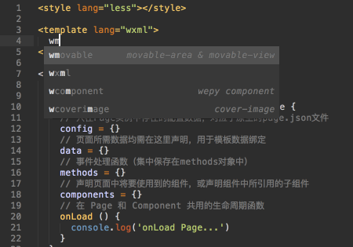

# 微信小程序 WePy Sublime 插件

| Wepy Page                 | 小程序组件                     |
|---------------------------|------------------------------|
|||

微信小程序 WePy Sublime 插件，集成部分 WePy 可复用代码块，整合小程序组件并生成代码片段。使用 WePy Snippets 开发小程序将变得更高效。

#### 在使用之前

> 文件后缀为.wpy，可共用Vue的高亮规则

Linux/Windows/OS X: `Ctrl+Shift+P` or `Cmd+Shift+P`

**Package Control: Install Package** 搜索 `Vue Syntax Highlight`

#### 安装方法

##### 1.前往指定目录

```sh
Nix: ~/.config/sublime-text-3/packages
Mac: ~/Library/Application\ Support/Sublime\ Text\ 3/Packages
Win: %APPDATA%\Sublime Text 3\Packages
```

##### 2.clone 该项目到该目录

```sh
git clone https://github.com/MiGongOrg/wepy-snippets.git 'wepy-snippets'
```

#### 使用方法

> 输入相应命令后按 `Tab`

**注：** 如果没有自动提示，请设置用户配置文件 `Preferences` - `Settings`

```
"auto_complete_selector": true
```

#### WePy

| 命令        | 说明            |
|------------|----------------|
| wpage      | wepy page      |
| wcomponent | wepy component |
| wrepeat    | wepy repeat    |

#### 小程序组件

##### 视图容器组件

| 命令          | 说明          |
|--------------|--------------|
| wview        | 视图容器       |
| wscrollview  | 可滚动视图区域  |
| wswiper      | 滑块视图容器    |
| wmovableview | 可移动的视图容器 |
| wcoverview   | 覆盖在原生组件之上的文本视图 |
| wcoverimage  | 覆盖在原生组件之上的图片视图 |

##### 基础内容组件

| 命令       | 说明      |
|-----------|----------|
| wicon     | Icon 图标 |
| wtext     | 文本      |
| wrichtext | 富文本    |
| wprogress | 进度条    |

##### 表单组件

| 命令               | 说明      |
|-------------------|----------|
| wbutton           | 按钮      |
| wcheckbox         | 多项选择器 |
| wform             | form 表单 |
| winput            | 输入框    |
| wlabel            | 标签      |
| wpicker           | 选择器    |
| wpickerview       | 滚动选择器 |
| wpickerviewcolumn | 选择列    |
| wradio            | 单项选择器 |
| wslider           | 滑动选择器 |
| wswitch           | 开关选择器 |
| wtextarea         | 多行输入框 |

##### 导航组件

| 命令        | 说明    |
|------------|--------|
| wnavigator | 页面链接 |

##### 媒体组件

| 命令         | 说明    |
|-------------|--------|
| waudio      | 页面链接 |
| wimage      | 图片    |
| wvideo      | 视频    |
| wwcamera    | 系统相机 |
| wliveplayer | 实时音视频播放 |
| wlivepusher | 实时音视频录制 |

##### 地图组件

| 命令  | 说明 |
|------|-----|
| wmap | 地图 |

##### 画布组件

| 命令     | 说明 |
|---------|-----|
| wcanvas | 画布 |

##### 开放能力

| 命令       | 说明    |
|-----------|--------|
| wopendata | 开放数据 |
| wwebview  | 网页容器 |

#### 小程序 API

##### 网络

###### 发起请求

| 命令       | 说明    |
|-----------|--------|
| wrequest  | 发起网络请求 |

###### 上传、下载

| 命令           | 说明    |
|---------------|--------|
| wuploadfile   | 将本地资源上传到开发者服务器 |
| wdownloadfile | 下载文件资源到本地 |

###### WebSocket

| 命令                | 说明    |
|--------------------|--------|
| wconnectsocket     | 创建一个 WebSocket 连接 |
| wonsocketopen      | 监听 WebSocket 连接打开事件 |
| wonsocketerror     | 监听 WebSocket 错误 |
| wsendsocketmessage | 通过 WebSocket 连接发送数据 |
| wonsocketmessage   | 监听 WebSocket 接收到服务器的消息事件 |
| wclosesocket       | 关闭 WebSocket 连接 |
| wonsocketclose     | 监听 WebSocket 关闭 |


##### 媒体

###### 图片

| 命令            | 说明    |
|----------------|--------|
| wchooseimage   | 从本地相册选择图片或使用相机拍照 |
| wpreviewimage  | 预览图片 |
| wgetimageinfo  | 获取图片信息 |
| wsaveimagetophotosalbum | 保存图片到系统相册 |

###### 录音

> 未添加 `startRecord` `stopRecord` 因在 1.6.0 版本开始接口不再维护，未添加

###### 录音管理

| 命令                 | 说明    |
|---------------------|--------|
| wgetrecordermanager | 获取全局唯一的录音管理器 |


###### 音频播放控制

> `playVoice` `pauseVoice` `stopVoice` 因在 1.6.0 版本开始接口不再维护，未添加

###### 音乐播放控制

> `getBackgroundAudioPlayerState` 等... 因在 1.2.0 版本开始接口不再维护，未添加

###### 背景音频播放管理

| 命令                        | 说明    |
|----------------------------|--------|
| wgetbackgroundaudiomanager | 获取全局唯一的背景音频管理器 |

###### 音频组件控制

> `createAudioContext` 因在 1.6.0 版本开始接口不再维护，未添加

| 命令                        | 说明    |
|--------------------------|--------|
| wcreateinneraudiocontext | 创建并返回内部 audio 上下文 innerAudioContext 对象 |

###### 视频

| 命令                     | 说明    |
|-------------------------|--------|
| wchoosevideo            | 拍摄视频或从手机相册中选视频 |
| wsavevideotophotosalbum | 保存视频到系统相册 |

###### 视频组件控制

| 命令                 | 说明    |
|---------------------|--------|
| wcreatevideocontext | 创建并返回 video 上下文 videoContext 对象 |

###### 相机组件控制

| 命令                  | 说明    |
|----------------------|--------|
| wcreatecameracontext | 创建并返回 camera 上下文 cameraContext 对象 |

###### 实时音视频

| 命令                      | 说明    |
|--------------------------|--------|
| wcreateliveplayercontext | 操作对应的 <live-player/> 组件 |
| wcreateliveplayercontext | 创建并返回 live-pusher 上下文 LivePusherContext 对象 |


##### 文件

| 命令               | 说明         |
|-------------------|-------------|
| wsavefile         | 保存文件到本地 |
| wgetfileinfo      | 获取文件信息   |
| wgetsavedfilelist | 获取本地已保存的文件列表 |
| wgetsavedfileinfo | 获取本地文件的文件信息 |
| wremovesavedfile  | 删除本地存储的文件 |
| wopendocument     | 新开页面打开文档 |
